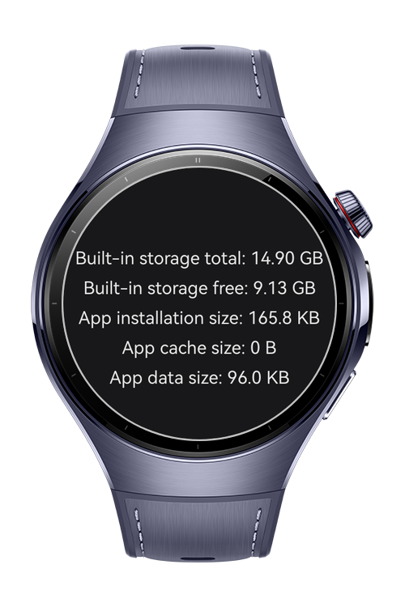

> **Note:** To access all shared projects, get information about environment setup, and view other guides, please visit [Explore-In-HMOS-Wearable Index](https://github.com/Explore-In-HMOS-Wearable/hmos-index).

# How to Show Storage Statistics
This sample shows how to integrate **storageStatistics** from **Core File Kit** to show the device's built-in total storage and the available space. And it also shows storage statistics about the application itself.

# Preview
<div>
  
</div>

# Use Cases
- Show the device's own total and free storages
- Show how much space the application itself is occupying
- Show how much space the application's own database is occupying

# Tech Stack
- **Language:** ArkTS
- **Framework**: HarmonyOS SDK 6.0.0(20)
- **Tools** DevEco Studio 6.1.1 Release
- **Libraries**:
  - **Core File Kit:** `storageStatistics` used to show device's built-in storage and app's own size.

# Directory Structure
```
entry/src/main/
├── ets/
│   ├── entryability/
│   │   └── EntryAbility.ets
│   ├── entrybackupability/
│   │   └── EntryBackupAbility.ets
│   └── pages/
│       └── Index.ets               # Full implementation for storage statistics
├── module.json5
└── resources/
    └── rawfile/
```

# Constraints and Restrictions
## Supported Devices
- Huawei Watch 5/6
- Huawei Watch Kids X1

# LICENSE
**How to Show Storage Statistics** is distributed under the terms of the **MIT License**.
See the [LICENSE](/LICENSE) for more information.
